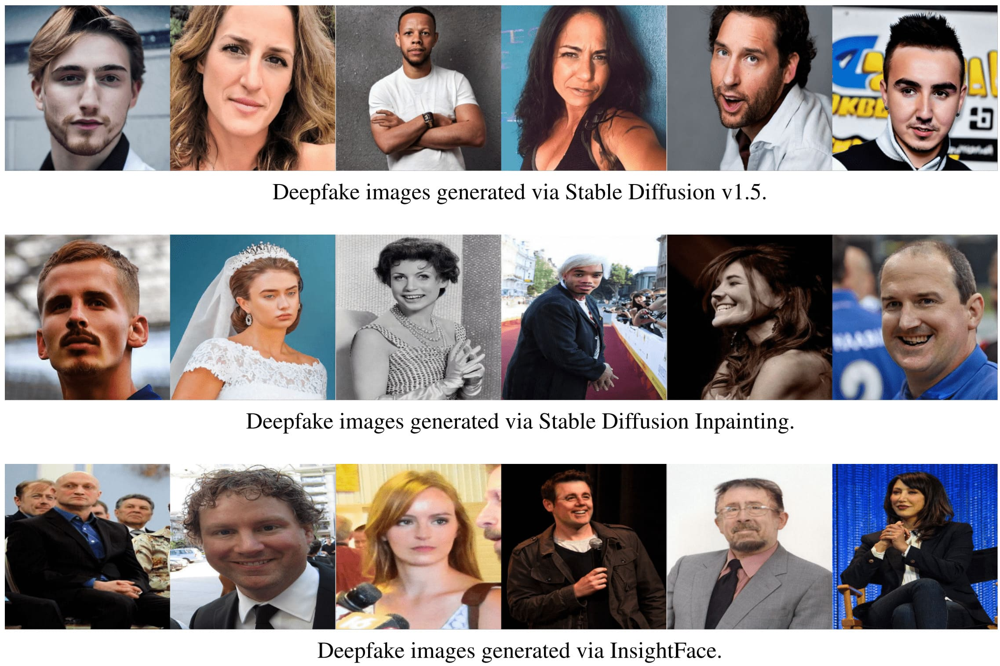
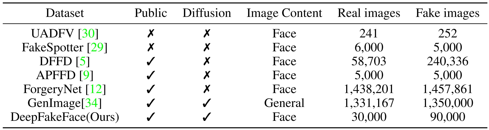
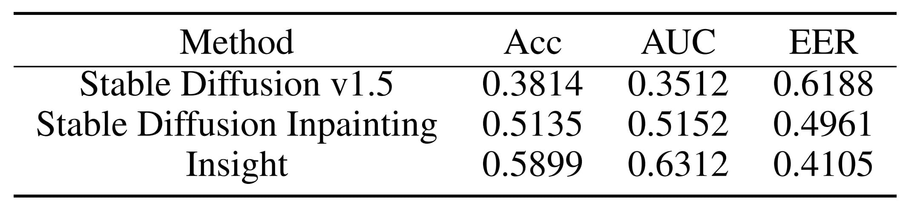
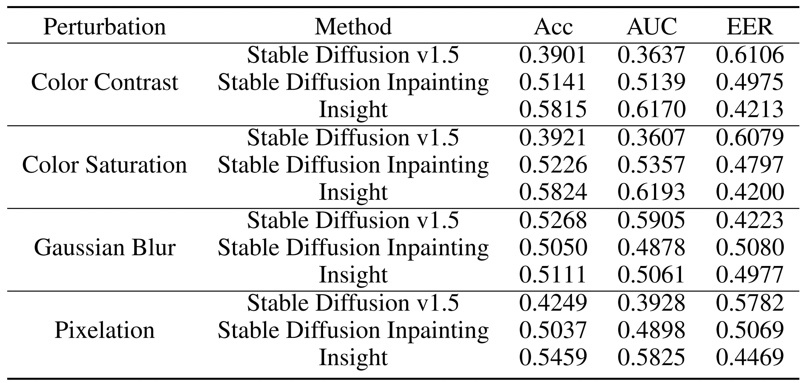

# DeepFakeFace


Code accompanying the paper
"Robustness and Generalizability of Deepfake Detection: A Study with Diffusion Models". [[Website](https://sites.google.com/view/deepfakeface/home)] [[paper](https://arxiv.org/abs/2309.02218)] [[HuggingFace Dataset](https://huggingface.co/datasets/OpenRL/DeepFakeFace)].


### Introduction

To protect the privacy of celebrities, we propose DeepFakeFace(DFF) dataset generated by advanced diffusion models.

Our dataset can be downloaded from [HuggingFace](https://huggingface.co/datasets/OpenRL/DeepFakeFace). Here are some example images in our dataset:
<div align="center">
    
</div>


### DeepFake Dataset Compare

We compare our dataset with previous datasets here:
<div align="center">
    
</div>


### Installation

[Diffusers](https://huggingface.co/docs/diffusers/installation), [Pytorch](https://pytorch.org/get-started/locally/), [InsightFace](https://github.com/deepinsight/insightface)

### Generate mask images required for deepfakes generated by Stabel Diffusion Inpainting

process.py generates corresponding mask images according to the label file of wiki. The mask images can also be generated by
other SOTA face detection methods such as [RetinaFace](https://github.com/biubug6/Pytorch_Retinaface).

```bash
python process.py
```

### Generate deepfake by Stable Diffusion V1.5

```bash
python generate_text2img.py
```

### Generate deepfake by Stable Diffusion Inpainting

```bash
python generate_inpainting.py
```

### Generate deepfake by InsightFace

[InsightFace](https://github.com/deepinsight/insightface) is a powerful toolbox for swapping faces.

```bash
python generate_insight.py
```

### Evaluation

We emplot SOTA detection method [RECCE](https://github.com/VISION-SJTU/RECCE) to detect deepfakes. As for distortion, we apply the same setting with [DeeperForensics](https://github.com/EndlessSora/DeeperForensics-1.0) to evaluate the robustness of detection methods.

```bash
python add_distortion.py
```

### Experimental Results

Performance of RECCE across different generators, measured in terms of Acc (%), AUC  (%), and EER (%):
<div align="center">
    
</div>


Robustness evaluation in terms of ACC(%), AUC (%) and EER(%):
<div align="center">
    
</div>

### Cite

Please cite our paper if you use our codes or our dataset in your own work:


```
@article{song2023deepfake,
  title={Robustness and Generalizability of Deepfake Detection: A Study with Diffusion Models},
  author={Haixu Song, Shiyu Huang, Yinpeng Dong, Wei-Wei Tu},
  journal={arXiv preprint arXiv:2309.02218},
  year={2023}
}
```
